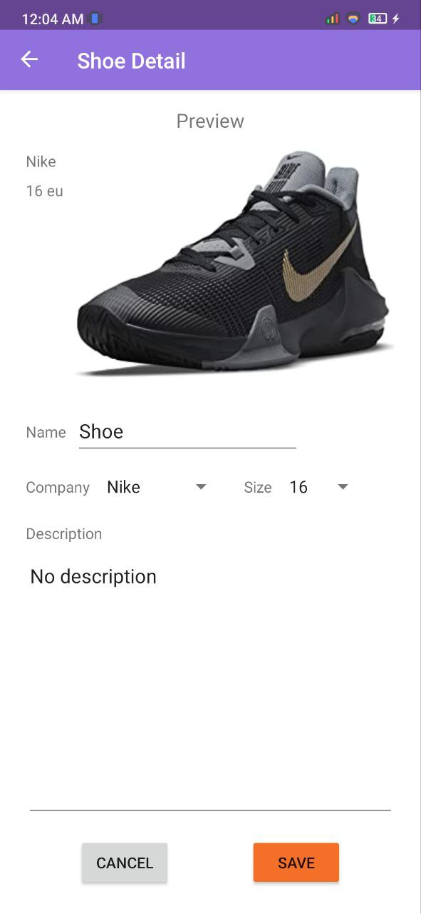

# Shoe Store (Android App)
Udacity Nanodegree: Advanced Android Kotlin Development - Project 1

## Screenshots

<table>
  <tr>
    <td></td>
    <td></td>
    <td></td>
  </tr>
  <tr>
    <td></td>
    <td></td>
  </tr>
</table>
